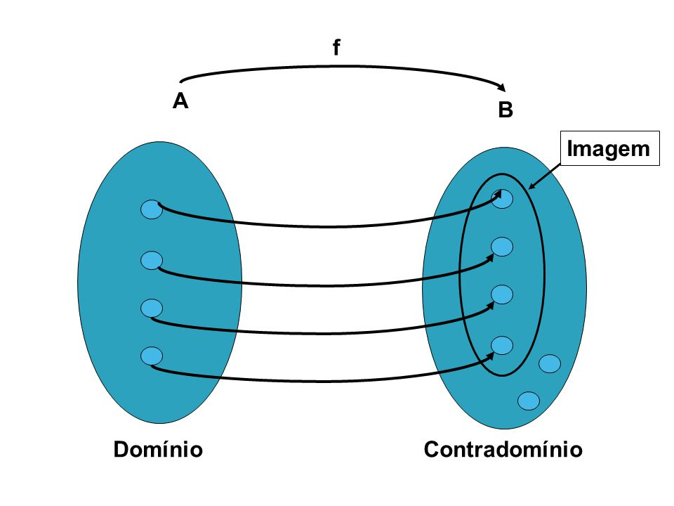
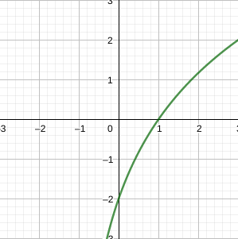
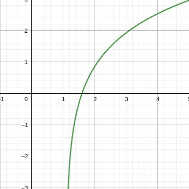
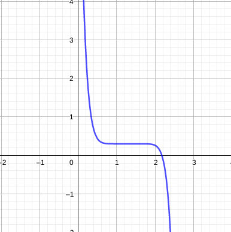
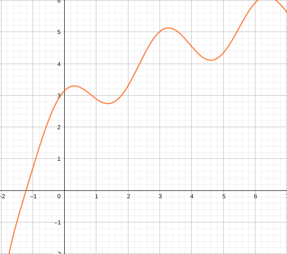

 
  

# Funções e suas representações

Uma função $f$ é uma lei que associa a cada elemento $x$ pertencente a um domínio $D$, exatamente um elemento $f(x)$ em um conjunto $E$.

Em geral consideramos as funções para qual $D$ e $E$ são conjuntos. $D$ é denominado domínio da função $f$, e $E$ por sua vez representa o contradomínio.

O número $f(x)$ para todo $x$ que pertença a $D$, define um novo conjunto chamado de imagem, ou $Im$. A imagem é constituída por todos os valores $f(x)$ que são obtidos pela lei de formação de todos os valores de $x$ no domínio.

Caso não seja possível aplicar a lei $f(x)$ sobre algum valor de $x$, onde $x$ seja real, diz-se que $x$ não pertence ao domínio de $f$.

**EX:** verifique quais valores de $f(x)$ são obtidos na aplicação.

$$f(x) = 2x - 3$$

Quando $x$ é um valor do conjunto de números ímpares entre 1 e 10.

$$x \in \{1, 3, 5, 7, 9\} $$

$x$ | $f(x)$
-|-
$1$ | $-1$
$2$ | $3$
$5$ | $7$
$7$ | $11$
$9$ | $15$ 

# Fundamentos de conjuntos

## Elementos ($x$)

Valor único dentro de um conjunto.

## Conjuntos

Agrupamento ou coleção de elementos, pode ser representado explicitamente por chaves $\{\}$.

## Restrição de elementos ($|$)

Indicado pelo operador "tal que" ($|$), identifica condições para que o elemento $x$ esteja no conjunto.

## Pertinência e não-pertinência
Indica se um elemento $x$ pertence ou não a um conjunto.

## Conjuntos numéricos comuns

São os conjuntos mais utilizados para representar elementos no Cálculo.

### Números inteiros ($\Z$)

$$\Z = \{..., -3, -2, -1, 0, 1, 2, 3,...\}$$

### Números reais ($\R$)

$$\R = \{..., -2, ..., -\frac{1}{2}, ..., 0, ..., 4, ..., \frac{12}{5}\}$$

**EX:** restrição de elemento em um conjunto. Digamos que se deseje, representar um conjuntos de números reais que não contenha elementos negativos. Verbalizando a seguir.

*"$x$ pertence ao conjunto dos reais tal que $x$ não é um número negativo, ou seja, $x$ é maior ou igual a zero."*

A simbologia matemática se torna:

$$A = \{x \in \R | z \ge 0\}$$

**EX:** represente explicitamente.

1)Números inteiros divisíveis por 3

$$\{..., -6, -3, 0, 3, 6, ...\}$$

ou
 

$$\{x \in \Z | x \mod 3 = 0\}$$

2)Números inteiros que são quadrados perfeitos

$$\{0, 1, 4, 9, ...\}$$

ou

$$\{x \in \Z | x = k^2, k \in \Z\}$$

# Representação gráfica de um função

O gráfico de uma função nos fornece uma imagem útil comportamental ou histórica da função. Para representa-lo utilizamos o sistema de coordenadas cartesianas, indicando os valores de $x$ do domínio no eixo horizontal (abscisas) e confrontando-os com os valores obtidos após aplicar a lei de formação $f(x)$, representando no eixo vertical (ordenadas).

### Como encontrar o domínio e imagem da função?

**1)** Observar o gráfico pode indicar o comportamento da função e dar uma ideia sobre quais valores não fazem parte de seu domínio.

**2)** Testar os valores arbitrários de $x$ na função afim de descobrir se existem valores que não podem fazer parte de $D$ e $Im$.

