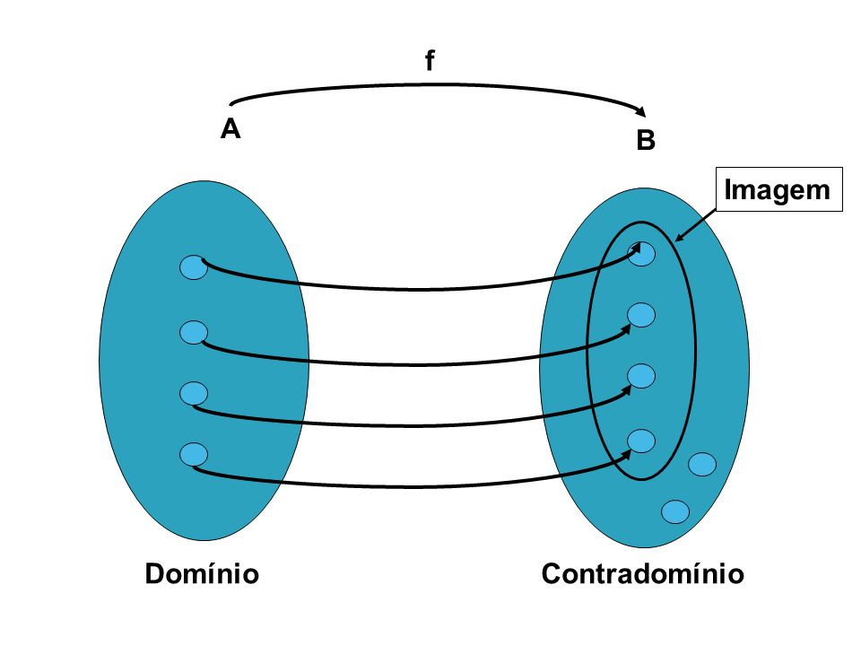

 
  
  
   
 
# Title

---

# Agenda

1. Introduction
2. Deep-dive
3. ...

---
 
# Introduction

Uma função $f$ é uma lei que associa a cada elemento $x$ pertencente a um domínio $D$, exatamente um elemento $f(x)$ em um conjunto $E$.

Em geral consideramos as funções para qual $D$ e $E$ são conjuntos. $D$ é denominado domínio da função $f$, e $E$ por sua vez representa o contradomínio.

O número $f(x)$ para todo $x$ que pertença a $D$, define um novo conjunto chamado de imagem, ou $Im$. A imagem é constituída por todos os valores $f(x)$ que são obtidos pela lei de formação de todos os valores de $x$ no domínio.

Caso não seja possível aplicar a lei $f(x)$ sobre algum valor de $x$, onde $x$ seja real, diz-se que $x$ não pertence ao domínio de $f$.

---
 Here is one mermaid diagram:
 

   graph TD
   A[Client] --> B[Load Balancer]
   B --> C[Server1]
   B --> D[Server2]
 

---
 And here is another:
 

   graph TD
   A[Client] -->|tcp_123| B(Load Balancer)
   B -->|tcp_456| C[Server1]
   B -->|tcp_456| D[Server2]
 

---

---
**EX:** verifique quais valores de $f(x)$ são obtidos na aplicação.

$$f(x) = 2x - 3$$

Quando $x$ é um valor do conjunto de números ímpares entre 1 e 10.

$$x \in \{1, 3, 5, 7, 9\} $$

$x$ | $f(x)$
-|-
$1$ | $-1$
$2$ | $3$
$5$ | $7$
$7$ | $11$
$9$ | $15$ 
---
# Fundamentos de conjuntos

## Elementos ($x$)

Valor único dentro de um conjunto.

## Conjuntos

Agrupamento ou coleção de elementos, pode ser representado explicitamente por chaves $\{\}$.

## Restrição de elementos ($|$)

Indicado pelo operador "tal que" ($|$), identifica condições para que o elemento $x$ esteja no conjunto.

## Pertinência e não-pertinência
Indica se um elemento $x$ pertence ou não a um conjunto.

## Conjuntos numéricos comuns

São os conjuntos mais utilizados para representar elementos no Cálculo.

### Números inteiros ($\Z$)

$$\Z = \{..., -3, -2, -1, 0, 1, 2, 3,...\}$$

### Números reais ($\R$)

$$\R = \{..., -2, ..., -\frac{1}{2}, ..., 0, ..., 4, ..., \frac{12}{5}\}$$

---
