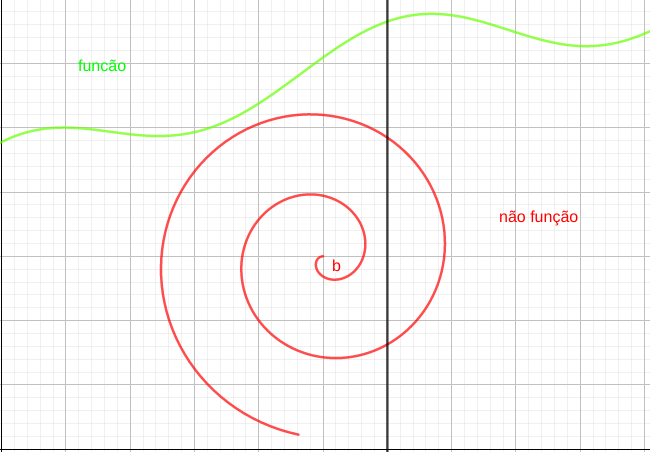
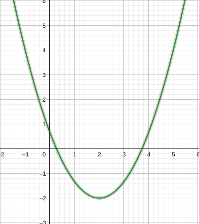
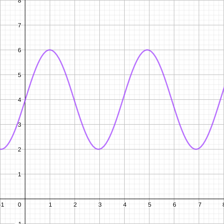
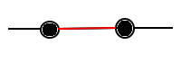
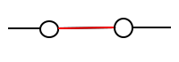
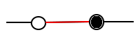

# Teste da reta vertical

Seja uma curva definida no plano  ,a curva irá representar uma função se, somente se, nenhuma reta vertical cortar a curva em mais de um ponto.

O teste da reta vertical implica que função  observada junto a reta  irá resultar em um único ponto , ou seja, interceptará a curva somente em , caso contrário a curva não representa uma função.

**(1)** Qualquer reta vertical intercepta a curva em um único ponto, ou seja, **(1)** representa uma função

**(2)** Por usa vez, existem múltiplos pontos de intercepção , ou seja, a curva **(2)** não representa uma função.

**EX:** verificar quais curvas a seguir representam funções.

É uma função

não é uma função

É uma função

# Representar os pontos e intervalos

Existem diversas formas de representar intervalos e pontos, vamos relembrar algumas dessas formas.

- **Intervalo fechado:** Consiste em uma região numérica limitada a dois pontos extremos, inclusive é representado por colchetes ou intervalos de reta com extremos fechados.

**EX:**  é o intervalo fechado limitado aos valores  e , inclusive representado em reta da seguinte forma:

Note que -1 e 1 pertencem ao intervalo 

- **Intervalo aberto:** regiao numérica similar ao intervalo fechado, porém seus extremos não estão inclusos no intervalo, representado por parenteses, 

**EX:** é um intervalo  que contém todos os números reais entre  e , exceto os próprios  e .

Note que 

- **Intervalo semiaberto:** intervalo que contém um de seus extremos, mas não contém o outro.

**EX:** (-1, 1], a parte inclusiva é denotada por colchetes e a não inclusa por parenteses.

Note que 

- **Intervalos descontínuos:** quando existem um ou mais pontos a dentro do intervalo , tal que . É representado por uma restrição explicita.

- **EX** intervalo  porém excluindo zero.

**EXEMPLOS**
- a)  
- b) 
- c) 
- d) 
- e) 

# Representações de funções na forma álgebrica

Em geral é inviável ou ineficaz representar uma função na forma gráfica. Por esse motivo, opta-se por realizar uma representação algébrica de uma  função, como a seguir:

- a) ,  e  são números reais.
- b) , , 
- c) 
- d) 

**OBS:** note que algumas dessas funções podem não estar definidas para algum(ns) números reais.

# Funções definidas por partes

São funções que são definidas algebricamente de maneira diferente para um ou mais intervalos. Uma função definida por partes não precisa ser continua.

**EX:**  é definida por partes tal que:

**EX:** a função módulo é, ou valor absoluto é definida por partes da seguinte maneira:

