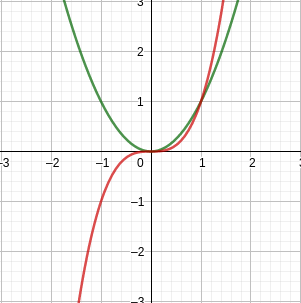
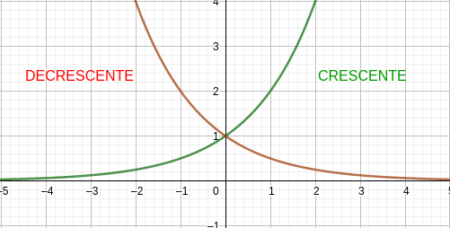

  
# Simetria

Se uma função satisfaz $f(x) = f(-x)$, diz-se que $f$ é uma função par. Por sua vez, se $f$ satisfaz $f(x) = -f(x)$, diz-se que $f$ é uma função impar.

**EX:** $x^2$ é uma função par pois:

$$
f(x) = x^2 = \begin{cases}
	x^2, se x \ge 0 \\
	(-x)^2 = x^2, x <0
	\end{cases}
$$

Por sua vez $x^3$ é impar.

## Função par

Satisfaz a $f(x) = f(-x)$, para todo $x$ em domínio.

**EX:** $x^2$ é uma função par e $x^3$ é uma função ímpar

**VERIFICANDO:** sejam $a$ e $b$, tais que $a=x$ e $b=-x$, fazemos $f(a)$ e $f(b)$:

$$f(a) = a^2$$

$$f(b) = b^2$$

$a^2$ e $b^2$ são positivos para qualquer valores reais, assim:

$$a^2 = x^2$ $

$$b^2 = (-x)^2 = x^2$$

Ou seja, $f(a) = f(b)$, assim, $f(x) = x^2$ é uma função par.

Usando o mesmo procedimento para $f(x) = x^3$:

$$f(a) = a^3$$

$$f(b) = b^3$$

$$
{a^3} = {a}^2a \iff \\
x^2x\iff \\
x^3
$$

$$
{b^3} = {b^2} b \iff \\
x^2x \iff \\
-x^3
$$

Ou seja, $f(a) = -f(b)$, portanto $f(x) = x^3$ é uma função ímpar.

**OBS:** o procedimento deve ser válido para todo $x$ do domínio.

# Função crescente e decrescente

Diz-se que $f(x)$ crescente em um intervalo $I$ quando:

$$f(x_1) < f(x_2) \text{, quando } x_1 < x_2$$

Por sua vez, a função é decrescente quando:

$$f(x_1) > f(x_2) \text{, quando } x_1 < x_2$$

Graficamente temos a representação como no esquema abaixo:

# Tipos de função

## Modelos lineares de uma função

Dizemos que um modelo representa uma função linear quando seu gráfico corresponde a uma reta ou quando pode ser representado na forma:

$$f(x) = mx + n$$

Em que $m$ e $n$ são constantes reais.

## Modelos polinomiais

Um polinômio é uma representação algébrica que segue o formato $P(x)$ tal que:

$$P(x) = a_0x^0 + a_1x^1 + a_2x^2 + ... + a_nx^n$$

Em que $a_0$, $a_1$, $a_2$, ..., $a_n$são denominados coeficientes números reais. uma função é dita polinomial se puder ser representada por $P(x)$ arbitrário.

O grau do polinômio equivale ao valor máximo de $n$ presente na expansão. Vale resaltar que $n \in \N$.

**Função constante:** $n = 0$

$$f(x) = a_0$$

**Função afim:** $n = 1$

$$f(x) = a_0 + a_1x$$

**Função de 2º grau:** $n = 2$

$$f(x) = a_0 + a_1x + a_1x^2$$

**Função de 3º grau:** $n = 3$

$$f(x) = a_0 + a_1x + a_1x^2 + a_3x^3$$

## Funções potência

São aquelas representadas por polinômios os quais $a_0, a_1, a_2, ... , a_{n-1} = 0$, ou seja, o único elemento não nulo é $a_n$, além disso $a_n = 1$.

**EX:**

$$
f(x) = x^2 \\
f(x) = x^3 \\
f(x) = x^5
$$

## Funções racionais

São representadas pelo quocinete $P(x)$ e $Q(x)$ tal que seu domínio será $Q(x) \ne 0$, assim:

$$f(x) = \frac{P(x)}{Q(x)}, Q(x) \ne 0$$
