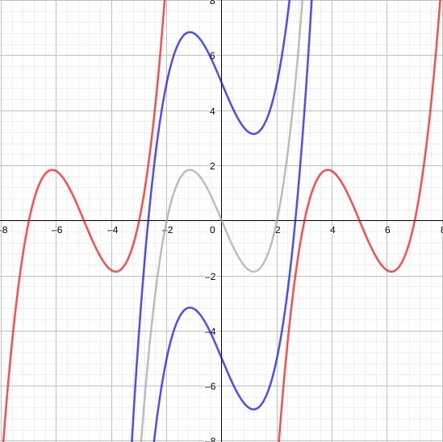
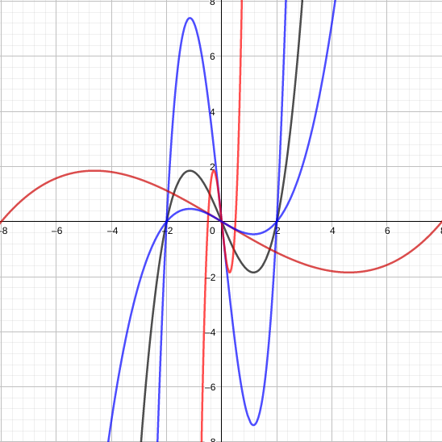

# Funções algébricas

Denominamos funções algébricas todas as funções obtidas por operações algébricas como adicção , produto e raiz a partir de polinômios.

**EX:**

Por sua vez os gráficos de funções algébricas assumem diferentes formas:

# Funções trigonométricas

Conjunto composto por funções de trigonometria, tais como ,  e .

O argumento das funções trigonométricas será sempre sempre em radianos.

## Domínio em imagem de funções trigonométricas 

 e  possuem imagem limitas entre  e , para qualquer valor real  em radianos, ou seja:

Tais funções também apresentam caracteristicas de periodicidade, pois:

A função  é ímpar enquanto  é par. Vale lembrar que .

Por sua vez  também é periódica, pois 

Vale ressaltar que devido  assumir valores nulos, existem pontos onde  não pode ser calculada. que são . Assim sua imagem será:

# Funções exponenciais

São funções que obedecem a forma , onde  é uma constante positiva não nula.

**EX:** (crescente) e (decrescente) 

# *Stewart(1.3)*
# Novas funções a partir de conhecidas

**Transformações:** podemos aplicar transformações e, funções em funções afim de obtermos novas funções.

**Deslocamentos:** seja uma constante  real positiva,
quando se conhece o gráfico de , obtemos:

*a)* 

*b)* 

*c)* 

*d)* 

Fazemos o deslocamento em c unidades para a direção indicada

**Reflexão e expansão:** processo de transformação

*a)* 

*b)* 

*c)* 

*d)* 

*e)*  espelha em torno de x

*f)*  espelha em torno de y

**DESLOCAMENTO**

**EXPANSÃO**

**REFLEXÃO**

