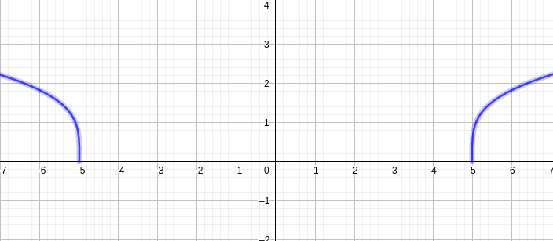
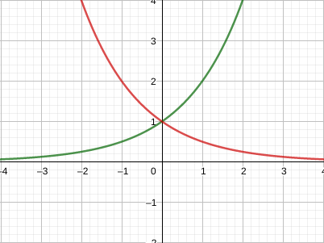

# Funções algébricas

Denominamos funções algébricas todas as funções obtidas por operações algébricas como adicção , produto e raiz a partir de polinômios.

**EX:**

$$f(x) = \sqrt{x^2 + 1}$$

$$
g(x) = \frac{x^4 - 16x^2}{x + \sqrt x} + (x - 2)\sqrt{x + 1}
$$

Por sua vez os gráficos de funções algébricas assumem diferentes formas:

$$f(x) = x\sqrt{x + 3}$$

$$g(x) = \sqrt[4]{x^2 - 25}$$

# Funções trigonométricas

Conjunto composto por funções de trigonometria, tais como $\sin(x)$, $\cos(x)$ e $\tan(x)$.

O argumento das funções trigonométricas será sempre sempre em radianos.

## Domínio em imagem de funções trigonométricas 

$\sin(x)$ e $\cos(x)$ possuem imagem limitas entre $-1$ e $1$, para qualquer valor real $x$ em radianos, ou seja:

$$
-1 \le \sin(x) \le 1 \\
-1 \le \cos(x) \le 1
$$

Tais funções também apresentam caracteristicas de periodicidade, pois:

$$
\sin(x + 2\pi) = \sin(x) \\
\cos(x + 2\pi) = \sin(x)
$$

A função $sin(x)$ é ímpar enquanto $cos(x)$ é par. Vale lembrar que $\tan(x) = \frac{sin(x)}{cos(x)}$.

Por sua vez $\tan(x)$ também é periódica, pois $\tan(x + \pi) = \tan(x)$

Vale ressaltar que devido $\cos(x)$ assumir valores nulos, existem pontos onde $tan(x)$ não pode ser calculada. que são $cos(x) = 0$. Assim sua imagem será:

$$\{Im(\tan(x) \subset \R | \cos(x) \ne x\}$$

# Funções exponenciais

São funções que obedecem a forma $f(x) = a^x$, onde $a$ é uma constante positiva não nula.

**EX:** $f(x) = 2^x$(crescente) e $f(x) = 0,5^x$(decrescente) 

# *Stewart(1.3)*
# Novas funções a partir de conhecidas

**Transformações:** podemos aplicar transformações e, funções em funções afim de obtermos novas funções.

**Deslocamentos:** seja uma constante $c$ real positiva,
quando se conhece o gráfico de $f(x)$, obtemos:

*a)* $y = f(x) + c \Uparrow$

*b)* $y = f(x) - c \Downarrow$

*c)* $y = f(x - c) \Rightarrow$

*d)* $y = f(x + c) \Leftarrow$

Fazemos o deslocamento em c unidades para a direção indicada

**Reflexão e expansão:** processo de transformação

*a)* $y = c \ f(x) \Updownarrow$

*b)* $y = \frac{f(x)}{c} \overset \Downarrow \Uparrow$

*c)* $y = f(cx) \Leftrightarrow$

*d)* $y = f(\frac x c ) \Rightarrow \Leftarrow$

*e)* $y = -f(x)$ espelha em torno de x

*f)* $y = f(-x)$ espelha em torno de y

**DESLOCAMENTO**

**EXPANSÃO**

**REFLEXÃO**

