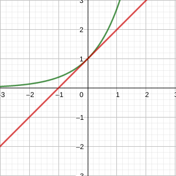
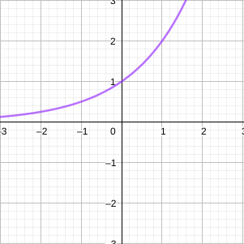
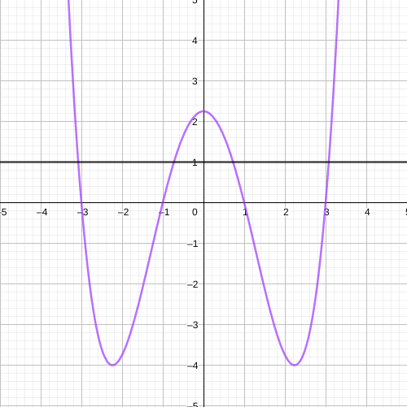

 
  
# Combinação de funções

Duas funções $f$ e $g$ podem ser combinadas para formar novas funções: $f + g$, $f - g$, $f \cdot  g$, e $\frac{f}{g}$.

$$
(f + g)(x) = f(x) + g(x) \\
(f - g)(x) = f(x) - g(x) \\
(f \cdot g)(x) = f(x) \cdot g(x) \\
(frac{f}{g})(x) = \frac{f(x)}{f(x)}
$$

Sejam os domínios de $f$ e $g$ os conjuntos $A$ e $B$, respectivamente, os conjuntos das funções combinadas serão:

$f + g, f - g, f \cdot g, $ é $A \ B$

$\frac{f}{g}, é \{x \in \R | g(x) \ne 0\}$

**EX:** determine do domínio de:

$$h(x) = \sqrt{x} - \sqrt{x - 2}$$

$$D(h) = {x \in \R | x \gt 2}$$

# Função composta

Dadas as duas funções $f$ e $g$, a função composta $f \circ g$, também denominada composição de $f$ e $g$, ou "f bola g", é definida por:

$$(f \circ g)(x) = f(g(x))$$

**EX:**

$$
f(x) = x^2 \\
g(x) = \cos(x) \\
h(x) = \frac{1}{x}
$$

$$
(f \circ g)(x) = \cos^2(x) \\
(f \circ h)(x) = (\frac{1}{x})^2
$$

$$
(g \circ f)(x) = \cos(x^2) \\
(g \circ h)(x) = \cos(\frac{1}{x})
$$

$$
(h \circ f)(x) = \frac{1}{x^2}\\
(h \circ g)(x) = \frac{1}{\cos(x)}
$$

**OBS:** note que não há relação direta dos conjuntos de comínio de suas funções compostas.

**EX2:** seja $f(x) = \sqrt x$ e $g(x) = \sqrt{2 - x}$, encontrar as funções a seguir e seus domínios:

*a)* $f \circ g$

$$\sqrt{\sqrt 2 - x}, D(f \circ g) = \{x \in \R | x \le 2\}$$

*b)*$g \circ f$

$$\sqrt{2 - \sqrt x}, D(g \circ g) = \{x \in \R | 0 \le x \le 4\}$$

*c)* $f \circ f$

$$\sqrt{\sqrt x}, D(f \circ f) = \{x \in \R | x \ge 0\}$$

*d)* $g \circ g$

$$\sqrt{2 - \sqrt{2 - x}}, D(g \circ g) = \{x \in \R | -2 \le x \le 2\}$$

# Funções exponenciais

Em geral, uma função exponencial é representada na forma.

$$f(x) = a^x$$

Onde $a$ é uma constante.

Se $x$ é um inteiro positivo.

$a^x = a \cdot a \cdot a \cdot a \text{}$, $x$ parcelas.

Se $x = 0$, $a^0 = 1$.

Se $x$ é um inteiro negativo.

$$a^x = \frac{1}{a^{-x}}$$

Se $x$ é um racional $x = \frac{p}{q}$, onde $p$ e $q$ são inteiros e $q \ne 0$, então:

$a^x = a^{\frac{p}{q}} \rightarrow \sqrt[q]{a^p}$ ou $(\sqrt[q]{a})^p$

Por sua vez, também podemos definir $a^x$onde $x$ é irracional. O resultado é obtido conceitualmente por sua aproximação sucessiva fr exponenciais cujo expoentes são racionais.

**EX:** existe um numero $k$ que representa o número $2^{\sqrt{3}}$ como aproximação $2^{\frac{p_1}{q_1}} \le 2^{\sqrt{3}} \le 2^{\frac{p_2}{q_2}}$, cujos $p_1$, $p_2$, $q_1$ e $q_2$ são racionais e $q_1$ e $q_2$ $\gt 0$.

Decorrem dos exponenciais as propriedades:

*1.* $a^{x+y} = a^x \cdot a^y$

*2.* $a^{x-y} = \frac{a^x}{a^y}$

*3.* $(a^x)^y = a^{a \cdot y}$

*4.* $(a \cdot b)^x = a^x \cdot b^x$

## O número $e$

Quando o valor da base $a$ da exponencial equivale ao "Número de Euler", aproximado pelo número:

$e = 2,71828$, onde $e$ é irracional.

Denomina-se uma função cuja base é $e$ como "exponencial natural", existem propriedades importantes quando se usa $e$ como base exponencial:

*1.* a reta tangente de $e^x$ no ponto $(0, 1)$, possui coeficiente angular exatamente igual a $1$.

*2.*utiliza-se uma relação númerica para representar qualquer exponencial de um número real $a$ na forma:

$$a^x = e^{\ln a}$$

# Funções inversas e logaritmos

Para definirmos conceitualmente funções inversas, vamos relembrar algumas relações.

*1.* uma função $f$ é denominada função injetora se ela nunca assume o mesmo valor duas vezes, ou seja, $f(x_1) \ne f(x_2)$, sempre que $x_1 \ne x_2$. Podemos verificar isso também com o teste da reta horizontal.

**TESTE DA RETA HORIZONTAL**: uma função é injetora se se nenhuma reta horizontal intercepta seu gráfico em mais de um ponto, graficamente:

**EX:** a função $f(x)=x^3$ é injetora, equanto $g(x) = x^2$ não é injetora.

**por que é importante saber se uma função é ou não injetora?:** funções injetoras, são precisamente, a classe de função que possuem inversas, denotada por $f^{-1}(x)$.

*2.* há uma relação entre domínio e imagem de uma função $f$ e sua inversa $f^{-1}$:

**DEFINIÇÃO:** seja $f$ uma função injetora cujo domínio é o conjunto $A$ e a imagem, $B$. Então sua inversa $f^{-1}$ tem domínio B e imagem $A$.

$$
D(f) = Im(f^{-1}) \\
Im(f) = D(f^{-1})
$$
**EX:** encontrar f{-1}(x) nos pontos a seguir:

*1)* $f^{-1}(1) = 3$

*2)* $f^{-1}(5) = 4$

*3)* $f^{-1}(-2) = 0$

## Propriedades das funções inversas

$$
f^{-1}(f(x)) = x, x \in D(f) \\
f(f^{-1}(x)) = x, x \in D(f^{-1})
$$

Como encontrar a função inversa da função injetora $f$?

**1.** escrever $y = f(x)$

**2.** isolar x na equação, escrevendo em termos de $y$ se possível.

**3.** para expressar $f^{-1}$ como função de $x$, troque $x$ por $y$. A equação resultante é:

$$y = f^{-1}(x)$$

**EX:** encontrar a função inversa de $f(x) = x^3 + 2$, passo a passo:

**1.**

$$y = x^3 + 2$$

**2.**

$$y - 2 = x^3$$

$$\sqrt[3]{y - 2} = x$$

**3.**

$$\sqrt[3]{x - 2} = y \Leftrightarrow f^{-1}(x) = \sqrt[3]{x - 2}$$

# Funções logarítmicas

Seja a função exponencial $f(x) = a^x$. a função exponencial é injetora, ou seja, existe uma função $f^{-1}(x)$ tal que:

$$f^{-1}(a^x) = x$$

$$a^{f^{-1}(x)} = x$$

Essa função $f^{-1}$ recebe o nome de função logarítmica e é definida por:

$$\log_a x = y \Longleftrightarrow a^y = x$$

Ou seja, se $x > 0$, $log_a x$ é o expoente que se deve elevar $a$ para obter $x$, ou seja, $\log_a (a^x) = x$ e $a^{log_a x} = x$.

## Propriedades de logaritmos

Se $x$ e $y$ forem números positivos, então:

**1.** $\log_a (xy) = \log_a x + \log_a y$

**2.** $log_a \left(\frac{x}{y}\right) = \log_a x - log_a y$

**3.** $log_a(x^y) = y \cdot log_a x$

**EX:** inversa de $f(x) = 2x -1$

Levando em conta $f(x) = ax^{2k + 1}$, $k \in \Z$, ela é injetora, ou seja, se $x$ for elevado a um número impar ela é injetora.

**1.**

$$y = 2x - 1$$

**2.**

$$2x = y + 1$$

$$x = \frac{y + 1}{2}$$

**3.**

$$x = \frac{y + 1}{2} \Longleftrightarrow f^{-1}(x) = \frac{x + 1}{2}$$

$x$ | $f(x)$
-|-
$1$|$1$
$2$|$3$
$3$|$5$

$x$ | $f^{-1}(x)$
-|-
$1$|$1$
$3$|$2$
$5$|$3$
