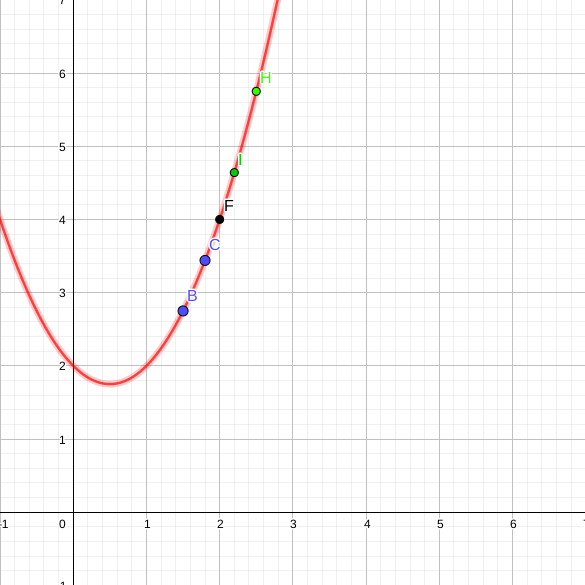

#### você está na primeira aula | [proxima aula](./03-09-19-limites-e-derrivadas.html)

#### Digitado por [$\color{black}\text{ Diefesson de Sousa Silva - 471842}$](mailto://diefesson.so@gmail.com)

# Limites e derrivadas

## Motivação

Problemas que envolvem cálculos de retas tangentes com aproximações por retas secantes são recorrentes em inúmeras áreas do conhecimento nas ciências exatas, como física clássica, mecânica, otimização e etc.

Problemas clássicos de física que envolvem aproximação de retas tangentes são: cálculo de velocidade, aceleração, força, trabalho, energia e etc.

## Vamos relembrar um problema clássico de cinemática

Suponha um veículo que percorre uma distância $x$ em metros em $t$ segundos. Observe a seguir:

Distância percorrida | Tempo
-|-
$x = 0 \text{ m}$ | $t = 0 \text{ s}$
$x = 2 \text{ m}$ | $t = 2 \text{ s}$
$x = 4 \text{ m}$ | $t = 3 \text{ s}$
$x = 6 \text{ m}$ | $t = 3,5 \text{ s}$
$x = 8 \text{ m}$ | $t = 4 \text{ s}$

Observe as perguntas a seguir:

*1)* Qual a velocidade média do veículo após $8 \text{ s}$?

**R:** neste caso, podemos apelar para a relação $V_m = \frac{\Delta S}{\Delta t}$

$$
V_m = \frac{8\text{ m}}{4 \text{ s}} = 2 \text{ m/s}
$$

*2)* A velocidade do veículo é constante ou variável?

**R:** veja a velocidade média nesses casos

$$V_m(0 \text{ até } 2) = \frac{2 \text{ m}}{2 \text{ s}} = 1 \text{ m/s}$$

$$V_m(2 \text{ até } 4) = \frac{2 \text{ m}}{1 \text{ s}} = 2 \text{ m/s}$$

$$V_m(0 \text{ até } 4) = \frac{4 \text{ m}}{3 \text{ s}} = 1,333... \text{ m/s}$$

Perceba que, em diferentes trechos, a velocidade média é alterada.

Usamos $\color{red} \text{limites}$ e $\color{red} \text{derrivadas}$ para representar essas variações.

## O limite de uma função

Vamos analisar o comportamento de uma função definida por $f(x) = x^2 - x + 2$ para valores próximos de $x = 2$, porém não iguais a $2$.

$\bold{x}$ | $\bold{f(x)}$ | $\bold{x}$ | $\bold{f(x)}$
-|-|-|-
$1$ | $2$ | $3$ | $8$
$1,5$ | $2,75$ | $2,5$ | $5,75$
$1,8$ | $3,44$ | $2,2$ | $4,64$
$1,9$ | $3,71$ | $2,1$ | $4,31$
$1,99$ | $3,97$ | $2,01$ | $4,03$

Veja graficamente o comportamento da função:

**IMPORTANTE:** veja que não precisamos calcular $f(2)$ para ver aproximadamente a aproximação $f(2) = 4$, ou seja, podemos visualizar o conceito que o $\color{red} \text{limite}$ da função $f(x)$ quando $x$ está próximo de $2$ como:

$$
\lim_{x \rightarrow 2} f(x) = 4 \text{ ou } \lim_{x \rightarrow 2} (x^2 - x + 2) = 4
$$

**DEFINIÇÃO:** suponha que $f(x)$ seja definido quando $x$ está próximo do ponto $a$, sem necessariamente, existir o ponto $a$. Então:

$$
\lim_{x \rightarrow a} f(x) = L
$$

E dizemos "o limite de $f(x)$, quando $x$ tende a $a$ é igual a $L$, se pudermos tornar os valores de $f(x)$ arbitrariamente próximos de a, mas não necessariamente, resolvendo $f(a)$.

Como determinar o valor da função:

$$f(x) = \frac{x^2 - 1}{x -1}$$

Próximo de $x = 1$, sabendo que $f(x)$ não pode ser calculado?

$\bold{ x < 1}$ | $\bold{f(x)}$ | $\bold{x > 1}$ | $\bold{f(x)}$
-|-|-|-
$0$      | $1$      | $2$      | $3$
$0,5$    | $1,25$   | $1,5$    | $2,5$
$0,8$    | $1,5$    | $1,2$    | $2,2$
$0,9$    | $1,8$    | $1,1$    | $2,1$
$0,99$   | $1,9$    | $1,01$   | $2,01$
$0,999$  | $1,999$  | $1,001$  | $2,001$
$0,9999$ | $1,9999$ | $1,0001$ | $2,0001$
