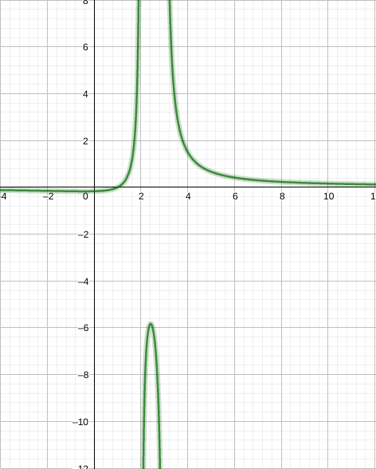
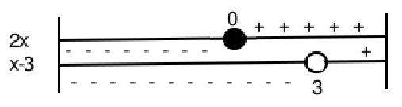

#### [aula anterior](./03-09-19-limites-e-derrivadas.html) |  [próxima aula](./10-09-19-calculos-usando-propriedades-dos-limites.html)

#### Digitado por [$\color{black} \text{Diefesson de Sousa Silva - 471942}$](mailto://diefesson.so@gmail.com)

# Limites(continuação)

Nas últimas aulas, verificamos a comportamento dos limites pela $\color{red} \text{esquerda}$ e pela $\color{red}\text{direita}$ de uma função. Relembrando:

Limite lateral pela direita de $f(x)$:

$$\lim_{x \rightarrow a^+}f(x) = L_1$$

Limite lateral pela esquerda $f(x)$:

$$\lim_{x \rightarrow a^-}f(x) = L_2$$

Definimos que, quando $L_1$ e $L_2$, a função $f(x)$ terá limite em $x = a$ se, e somente se:

$$\lim_{x \rightarrow a^+}f(x) = \lim_{x \rightarrow a^-}f(x)$$

Ou seja:

$$\lim_{x \rightarrow a}f(x) = L_1 = L_2$$

## Limites infinitos

Vamos observar o que acontece com funções reais próximas de um ponto de indeterminação.

**EX**

$$f(x) = \frac{1}{x^2}$$

Veja que próximo de $x = 0$, bilateralmente, há a seguinte condição:

*1.*

$$\lim_{x \rightarrow 0^+}f(x) = +\infty (\text{infinito})$$

Veja que $f(x) = \dfrac{1}{x^2}$ tende a um valor muito grande e positivo quando $x$ está próximo de $x = 0$ pela direita.

*2.*

$$\lim_{x \rightarrow 0^-}f(x) = +\infty(\text{infinito})$$

Por outro lado, ao analisar o comportamento pela esquerda($0^-$), elevemos um número negativo ao quadrado, que o torna positivo, Tem-se p mesmo fenômeno quando $x > 0$, logo:

$$\lim_{x \rightarrow 0^-}f(x) = \lim_{x \rightarrow 0^+}f(x) = +\infty$$

**DEFINIÇÃO:**

Quando o limite lateral de uma função($x \rightarrow a^- ou x \rightarrow a^+$) é infinito, dizemos que a reta $x = a$ é uma $\color{red}\text{assíntota vertical}$ de $f(x)$. Por sua vez, pelo menos uma das seguintes condições deve ser satisfeita:

$$\lim_{x \rightarrow a}f(x) = +\infty \text{ ou } -\infty$$

$$\lim_{x \rightarrow a^-}f(x) = +\infty \text{ ou } -\infty$$

$$\lim_{x \rightarrow a^+}f(x) = +\infty \text{ ou } -\infty$$

**EX:**

Verifique a função possuí assíntotas verticais:

$$f(x) = \frac{x - 1}{x^2 - 5x + 6}$$

---

$$
x^2 - 5x + 6 \Rightarrow \Delta \\
\Delta = b^2 - 4ac \Leftrightarrow \\
\Delta = (-5)^2 - 4\cdot1\cdot6 \Leftrightarrow \\
\Delta = 25 - 24 \Leftrightarrow \\
\Delta = 1
$$

$$
x = \frac{-b \pm \sqrt\Delta}{2a}
$$

$$
x_1 = \dfrac{5 + 1}{2} = 3
$$

$$
x_2 = \dfrac{5 - 1}{2} = 2
$$

$$
\lim_{x \rightarrow 2^-} f(x) = + \infty
\lim_{x \rightarrow 2^+} f(x) = - \infty
$$

$$
\lim_{x \rightarrow 3^+} f(x) = - \infty
\lim_{x \rightarrow 3^-} f(x) = + \infty
$$

**ATIVIDADE:**

Encontrar a(s) assíntotas da função:

$$f(x) = \frac{2x}{x-3}$$

E determinar seus limites laterais.

Assíntota em $x = 3$

$$\lim_{x \rightarrow 3^-} = -\infty \lim_{x \rightarrow 3^+} = +\infty$$

$\bold x$ | $\bold {f(x)}$
-|-
$2$     | $-4$
$2,5$   | $-10$
$2,8$   | $-28$
$2,9$   | $-58$
$2,99$  | $-598$
$2,999$ | $-5998$

$\bold x$ | $\bold{f(x)}$
-|-
$4$     | $8$
$3,5$   | $14$
$3,2$   | $32$
$3,1$   | $62$
$3,01$  | $602$
$3,001$ | $6002$
