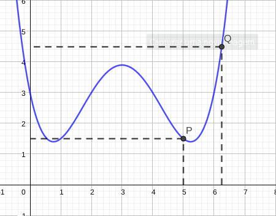

#### [aula anterior](./23-09-19-assintotas-verticais-e-horizontais.html) | [próxima aula](25-09-19-limites-e-continuidade.html)

#### Digitado por [$\color{black} \text{Diefesson de Sousa Silva - 471942}$](mailto://diefesson.so@gmail.com)

# Derivadas e taxa de variação

**DEFINIÇÃO:** uma reta tangente a uma curva $y = f(x)$, com ponto $P(x, f(x))$ é uma reta que passa pelo ponto $P$ e que possui a inclinação $m$, tal que:

$$
m = \lim_{x \rightarrow a} \left(
\frac{f(x) - f(a)}{x - a}
\right)
$$

Se o limite existir.

**EXEMPLO:** encontrar uma equação de reta tangente a curva $y = x^2$ no ponto $(1, 1)$:

$$
\lim_{x \rightarrow 1} \left(
\frac{x^2 - 1}{x - 1}
\right) \Leftrightarrow
$$

$$
\lim_{x \rightarrow 1} \left(
\frac{(x + 1)(x - 1)}{x - 1}
\right) \Leftrightarrow
$$

$$
\lim_{x \rightarrow 1} \left(
x + 1
\right) \Leftrightarrow
$$

$$2$$

Uma definição quando substituímos $x - a$
por $h$ e aproximamos $x \rightarrow a$, ou seja, $h \rightarrow 0$ e a inclinação $m$ da tangente é expressa por:

$$
m = \lim_{h \rightarrow 0}\left(
\frac{f(a + h) - f(a)}{h}
\right)
$$

**EXEMPLO:** encontrar a reta tangente  à curva $f(x) = \dfrac{3}{x}$ no ponto $(3, 1)$

$$
\lim_{h \rightarrow 0} \left(
\frac
{\frac{3}{3+h} - \frac{3}{3}}
{h}
\right) \Leftrightarrow
$$

$$
\lim_{h \rightarrow 0} \left(
\frac
{\frac{3}{3+h} - 1}
{h}
\right) \Leftrightarrow
$$

$$
\lim_{h \rightarrow 0} \left(
\left(
\frac
{3}
{3+h}
\right) \cdot \frac{1}{h}
\right) \Leftrightarrow
$$

$$
\lim_{h \rightarrow 0} \left(
\frac
{3-(3 + h)}
{(3 +h)h}
\right) \Leftrightarrow
$$

$$
\lim_{h \rightarrow 0} \left(
\frac
{-h}
{(3 +h)h}
\right) \Leftrightarrow
$$

$$
\lim_{h \rightarrow 0} \left(
\frac
{-1}
{3 +h}
\right) \Leftrightarrow
$$

$$-\frac{1}{3}$$

## Interpretação geométrica

Ponto $P(x_0, y_0)$

Ponto $Q(a, f(a)) = (x_0 + h, y_0 + f(x+0 + h))$

Equação da reta:

$$y-y_0 = m(x-x_0)$$

$$\text{ou}$$

$$m = \frac{y - y_0}{x - x_0}$$

## Derivadas

**DEFINIÇÃO:** a derivada de uma função $f$ em um número $a$ é determinada por $f'(a)$ e corresponde a:

$$
f'(a) =
\lim_{h \rightarrow 0} \left( \frac{f(a + h) - f(a)}{h} \right)=
\lim_{x \rightarrow 0} \left( \frac{f(x) - f(a)}{x - a} \right)
$$

Podemos dizer então que a reta tangente a $y = f(x)$ no ponto $P(a, f(a))$ é a reta que passa em $a$ e que possuí inclinação $m$ igual a $f'(a)$ no ponto $a$.

De modo geral, podemos representar a equação da reta tangente na forma.

$$y - f'(a) = f'(a) \cdot (x - a)$$

Podemos dizer, também que $f'(a)$ representa a taxa de variação em uma função em um determinado ponto $P(a, f(a))$.

São válidas, portanto, as afirmações a seguir:

*1.* Se $f(x)$ é crescente na vizinhança de $a$ então $f'(a) > 0$.

*2.* Caso $f(x)$ seja decrescente, $f'(a) < 0$.

*3.* Se $f(x)$ tem ponto máximo ou ponto mínimo em $a$ ou $f(x)$ for constante, $f'(a) = 0$.
